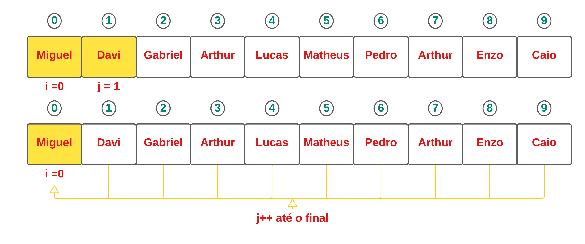

# Exercício de Tipo Abstrato de Dados Lista - Exercício 2

<h1> Remoção de nomes iguais em uma lista

## Conteúdos

 <a href="#apresentação">Apresentação</a> •
 <a href="#lógica">Lógica</a> • 
 <a href="#perguntas">Perguntas</a> • 
 <a href="#representação-gráfica">Representação gráfica</a> • 
 <a href="#compilação-e-execução">Compilação e Execução</a> • 
 <a href="#autor">Autor</a>

---

## Apresentação

Foi proposto pelo professor [Michel Pires da Silva](http://lattes.cnpq.br/1449902596670082) da matéria de `Arquitetura e Estruturas de Dados 1 do 3º Período do curso de Engenharia da Computação` 4 diferentes exercícios relacionados a Tipo Abstrato de Dados Lista, com o objetivo de praticar e adquirir experiencia com esse TAD e seus métodos. O exercício de número 3 foi resolvido utilizando o tipo `Lista Linear` e seus métodos padrões e mais algumas inserções para solucionar o problema proposto no qual tinha o objetivo de identificar nomes iguais em uma lista e remove-los sem mover os "ponteiros", com isso foi feita uma tentativa em que foi obtido êxito para a solução deste problema!

---

## Lógica

Foi proposto para que seja criada uma lista que armazene um conjunto de 100 listas, para isso foi feito uma leitura de um arquivo de texto _nomes.txt_ no qual possuía um total de 100 nomes, sendo eles iguais ou não e com isso era inserido esses nomes em uma lista linear através da função chamada na main `AbreArquivo`, logo após ser feita a estruturação da lista com os nomes foi criada uma função chamada `RemoveIgualdade` que é funciona da seguinte maneira:
Primeiramente foi declarada duas variáveis booleanas e tornando-as do tipo *false*, sendo elas _repete_ e _verifica_ e também foi feita a criação de um vetor de string denominado _aux.nomes_.
Diante disso foi criado um `FOR`, sendo ele de *i* para que recebe a primeira posição dentro da lista e um segundo `FOR`, sendo ele de *j* dentro do primeiro `FOR`, onde iniciara uma posição à frente da posição de *i* e consistira na lógica de rodar todo o vetor pela `FOR` de *j* verificando se existe algum nome igual e caso seja encontrado é feita uma busca dentro do vetor _aux.nomes_ onde são armazenados os nomes que foram repetidos, para verificar se o nome encontrado já foi repetido uma outra vez pois esse vetor de string serve somente para informar os nomes que foram repetidos então deve armazena-los apenas uma vez, caso seja repetido a variável _repete_ tornará *true* e caso ela seja desse valor não irá ser armazenado esse nome dentro desse vetor, caso não existir o nome vai ser adicionado a esse vetor e por final o nome que foi dado como igual irá receber a variável invalida, ou seja, removendo ele sem que seja movido um ponteiro, tornando ele inacessível, imprimindo todos aqueles nomes que foram encontrados iguais e uma nova lista com espaços onde esse nomes se situaram. 

## Perguntas

* ### Como você gerenciaria os espaços em branco para novas inserções?

  Como o programa trata a exclusão de nomes iguais pegando a variável booleana _invalida_ que recebe valor *false*, é deixado então um espaço no lugar de nomes repetidos. Com isso, para ser feita a inserção novamente nesses espaços em brancos iria ser gerenciado da seguinte maneira. Primeiramente iria ser feita uma nova função `InsereEspacoVazios`, onde iria receber o ponteiro da lista como parâmetro iniciando então a função com um `FOR` de *i* onde começaria da primeira posição da lista, onde vai rodar essa lista verificando em um `IF` se a posição de *i* daquela lista fosse comparada e se fosse igual a um valor *false*, que no caso estaria o espaço em branco, iria ser inserido um nome nessa posição removendo esse espaço em branco.

* ### Qual seria o custo dessas novas inserções?

  O custo dessa nova inserção se trataria de O(n) por possuir apenas um `FOR`.

---

## Representação gráfica

Segue a representação gráfica de um exemplo de uma verificação de igualdades de nomes fornecida atraves da leitura de um arquivo _nomes.txt_:

    As setas são as comparação que são feitas a partir do j que vai rodando até o final e comparando com a posição i.

---

## Compilação e Execução

O programa feito de acordo com a proposta possui um arquivo Makefile que realiza todo o procedimento de compilação e execução. Para tanto, temos as seguintes diretrizes de execução:

| Comando                |  Função                                                                                           |                     
| -----------------------| ------------------------------------------------------------------------------------------------- |
|  `make clean`          | Apaga a última compilação realizada contida na pasta build                                        |
|  `make`                | Executa a compilação do programa utilizando o gcc, e o resultado vai para a pasta build           |
|  `make run`            | Executa o programa da pasta build após a realização da compilação             

---

## Autor

Criado por [Pedro Henrique Louback Campos](https://www.linkedin.com/in/pedro-henrique-louback-campos-0a4a03205/)

Aluno do 3° periodo do curso de `Engenharia da Computação` no [CEFET-MG](https://www.cefetmg.br)
